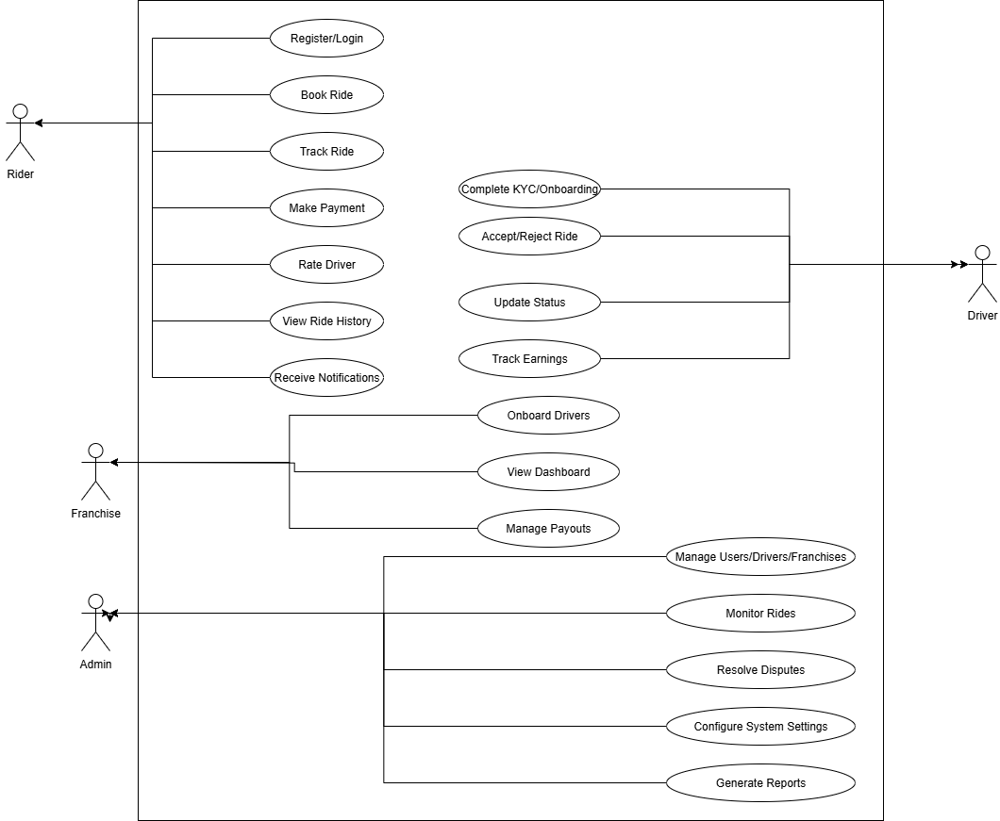
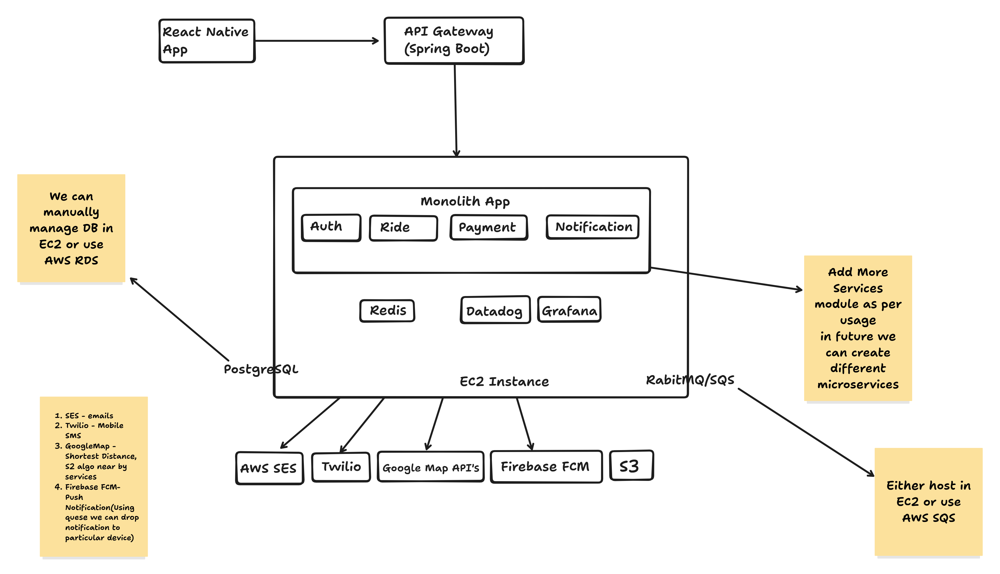

# **Business Plan: CabSe**

**Company Name:** CabSe
**Co-founders:** Deepanshi Gaur and Reena
**Date:** July 22, 2025

---

## **Table of Contents**

1.  **Executive Summary**
2.  **Company Description**
    *   Mission Statement
    *   Vision Statement
    *   Legal Structure
3.  **Detailed Market Analysis**
    *   Market Size & Growth Potential
    *   Target Market Analysis
    *   Competitive Landscape Analysis
    *   Market Trends & Growth Drivers
    *   Regulatory Environment
    *   CabSe's Competitive Advantage
4.  **Business Model**
    *   Value Proposition
    *   Franchise Model
    *   Services Offered
    *   Revenue Streams
5.  **Marketing and Sales Strategy**
    *   Target Audience
    *   Marketing Objectives
    *   Marketing Channels
    *   Sales Strategy
6.  **Operations Plan**
    *   Location and Facilities
    *   Key Processes and Technologies
    *   Team Members and Organizational Roles
    *   Organizational Structure
7.  **Technology and Product Plan**
    *   MVP Development and Launch Timeline
    *   Architecture Overview
    *   Use Case Diagram
    *   Architecture Diagram
    *   Technology Stack
    *   Key Modules & Specifications
    *   Scalability, Security, and Compliance
8.  **Management Team**
9.  **Financial Plan and Projections**
    *   Startup Costs and Funding Requirements
    *   Monthly Operating Expenses
    *   Revenue Projections and Business Model
    *   Profit and Loss Projections
    *   Cash Flow Analysis and Break-Even
    *   Funding Strategy
    *   Key Financial Metrics & Risk Mitigation
10. **Future Goals**
    *   State-wise Expansion
    *   Introduction of Bike Rental Services

---

## **1. Executive Summary**

CabSe is a pioneering ride-hailing service poised to revolutionize transportation in India's underserved Tier 2 cities. While existing giants like Ola and Uber primarily focus on metropolitan areas, CabSe will cater to the burgeoning demand for reliable, affordable, and accessible transportation in the heartland of India, starting with a strategic rollout in Rajasthan.

Our unique business model is built on a symbiotic franchise system. We will partner with established local cab service providers, including tour and travel operators, who will act as our city-level franchisees. These partners bring invaluable local knowledge, existing driver networks, and a deep understanding of the market. CabSe will provide the technology platform, brand identity, and operational support, creating a powerful synergy for rapid growth and market penetration.

Franchisees will earn commissions based on the number of rides completed by their onboarded drivers, incentivizing them to expand their driver network and promote the service actively. This model significantly reduces our direct operational overhead while empowering local entrepreneurs. We will offer a comprehensive suite of services, including inter-city and intra-city rides, scheduled bookings, and carpooling, all at a lower commission rate per ride compared to the industry titans.

Our phased rollout will commence in Rajasthan, with an MVP ready by the end of October 2025 and a full product launch in January 2026. Post-launch, we will meticulously analyze the market response to refine our services and operational strategies before expanding to other states. Our long-term vision is to become the leading cab service in Tier 2 and Tier 3 cities across India and to diversify our offerings to include a bike-on-rent model.

This business plan outlines our strategy to capture this significant market opportunity, detailing our in-depth market analysis, innovative business model, robust operational and technology plans, detailed financial projections, and a clear roadmap for future growth.

---

## **2. Company Description**

*   **Company Name:** CabSe
*   **Co-founders:** Deepanshi Gaur and Reena
*   **Mission Statement:** To provide safe, affordable, and reliable ride-hailing services to every corner of urban and semi-urban India, empowering local entrepreneurs and improving connectivity for all.
*   **Vision Statement:** To be the most trusted and preferred transportation partner in Tier 2 and Tier 3 cities across India, fostering economic growth and simplifying daily travel.
*   **Legal Structure:** CabSe will be registered as a Private Limited Company in India. This structure will provide the necessary legal framework for fundraising, limiting liability, and issuing shares as we grow. We will ensure all necessary registrations, including with the Ministry of Corporate Affairs and GST, are completed.

---

## **3. Detailed Market Analysis**

### **Market Size & Growth Potential**

The Indian ride-hailing market presents exceptional growth opportunities. The taxi services market, valued at **USD 20.50 billion in 2024**, is projected to reach **USD 61.58 billion by 2033**, exhibiting a robust CAGR of **13.00%**. The ride-hailing segment specifically is expected to grow even faster, from **USD 950.66 million in FY2024 to USD 3,766.79 million in FY2032**, representing a CAGR of **18.78%**.

This growth is driven by rapid urbanization, increasing smartphone penetration (now exceeding 80% in tier-2 cities), rising disposable incomes, and a shift toward shared mobility solutions as an alternative to vehicle ownership.

### **Target Market Analysis**

#### **Primary Customer Demographics**

*   **Age Groups:**
    *   **Millennials (25-40 years)**: Represent the largest user segment, comprising tech-savvy professionals who prioritize convenience and are early adopters of app-based services.
    *   **Gen Z (18-25 years)**: Students and young professionals who value speed, affordability, and bike taxi services for shorter distances.
    *   **Baby Boomers (50+ years)**: Show a high preference for car services (82% usage) and prioritize comfort and reliability.
*   **Income Segments:**
    *   **Middle to upper-middle class**: The average income in tier-2 cities is approximately ₹32,000 per month.
    *   **Working professionals**: Daily commuters who require reliable transportation for work (44% use ride-hailing for commuting).
    *   **Students**: Cost-conscious users seeking affordable transportation options.
*   **Geographic Focus:** Our focus on **Rajasthan** is strategically sound, as the state:
    *   Attracts over **2 million foreign tourists annually** (21% of India's total foreign arrivals).
    *   Has extensive transportation demand with **5,000+ buses** and **731,000 average daily passengers** on RSRTC.
    *   Shows high travel demand during festivals (passenger loads reaching 97%).
    *   Has growing industrialization driving transportation needs.

#### **Customer Preferences & Needs**

Based on comprehensive surveys, customers prioritize:

1.  **Ride Experience (53%)**: Including vehicle condition, driver behavior, and ease of payment.
2.  **Low Fares (47%)**: Cost-effectiveness remains crucial.
3.  **Safety (ranked #1)**: Especially important for women passengers.
4.  **Availability (ranked #2)**: Reliable service with minimal waiting times.
5.  **Convenience**: Easy booking, real-time tracking, and multiple payment options.

#### **Usage Patterns:**

*   **10-20 km trips** represent the "sweet spot" for ride-hailing services.
*   **66% of users** consider ride-hailing more economical than car ownership.
*   **Two-thirds of users** avail services at least once weekly.
*   Peak usage for airport transfers, work commutes, and social outings.

### **Competitive Landscape Analysis**

#### **Major Players & Market Share**

*   **Ola**: Commands approximately **56.2-59%** market share with operations in **250+ cities** and **2.5 million drivers**.
*   **Uber**: Holds **39.6-50%** market share, operates in **98 cities** with **450,000+ drivers**.
*   **Emerging Competitors**: Rapido, Namma Yatri, and InDrive are disrupting the market with innovative models like subscriptions and zero commissions.

#### **SWOT Analysis of Existing Players**

*   **Strengths**: Large driver networks, brand recognition, advanced technology.
*   **Weaknesses**: **High commission rates (20-40%)** creating driver dissatisfaction, frequent cancellations, surge pricing issues, and a **limited focus on tier-2 cities**.

### **Market Trends & Growth Drivers**

1.  **Franchise Model Adoption**: Existing players like **Chiku Cab** offer franchise opportunities with investments starting at ₹2 lakhs.
2.  **Commission Model Disruption**: Success of **zero-commission models** is forcing market leaders to innovate.
3.  **Tier-2 City Expansion**: **Uber is testing flexible pricing** in tier-2/3 cities like Ajmer and Jodhpur.
4.  **Intercity Travel Growth**: The carpooling market is projected to generate **$85+ million** in 2025.
5.  **Technology Integration**: AI-powered route optimization, EV adoption, and **ONDC platform integration** are key trends.

### **Regulatory Environment**

*   **20% commission cap** mandated by the government (drivers receive at least 80% of the fare).
*   **Surge pricing limited to 1.5x base fare**.
*   **12-hour daily driving limit** and mandatory insurance requirements.

### **CabSe's Competitive Advantage**

Our franchise-based approach targeting tier-2 cities with existing tour operators as franchisees addresses several key market gaps:

1.  **Lower Commission Structure**: More attractive for drivers compared to Ola/Uber's 20-40%.
2.  **Local Expertise**: Leveraging existing operators who understand regional markets.
3.  **Untapped Tier-2 Market**: This segment has high growth potential but is currently underserved.
4.  **Multiple Service Offerings**: A comprehensive suite including inter-city, intra-city, scheduled rides, and carpooling.
5.  **Strategic Rajasthan Focus**: Capitalizing on high tourism and transportation demand.

---

## **4. Business Model**

### **Value Proposition**

*   **For Passengers:** A reliable, safe, and affordable ride-hailing service with transparent pricing, multiple ride options, and the convenience of a user-friendly app.
*   **For Drivers:** Higher earnings due to lower commission rates per ride. Access to a wider customer base and the flexibility to work on their own schedule.
*   **For Franchisees:** An opportunity to partner with a growing brand, leverage technology to enhance their existing business, and generate a new revenue stream through commissions.

### **Franchise Model**

Our franchise model is the cornerstone of our strategy, designed for a win-win partnership.

*   **Franchise Profile:** We will target existing cab service providers, tour and travel operators, and transport business owners in various districts and tehsils of Rajasthan. These entities already have a foothold in the market, possess a fleet of vehicles, and have established networks of drivers.
*   **Franchise Fees and Commission Structure:**
    *   **Franchise Fee:** A one-time, non-refundable fee will be charged for granting franchise rights. The fee will be higher for a district-level franchise and lower for a tehsil-level franchise. (e.g., ₹5-10 lakhs for a district, ₹2-5 lakhs for a tehsil).
    *   **Commission Structure:** Franchisees will earn a commission on every ride completed by a driver registered under their franchise. This incentivizes them to onboard more drivers and promote the service. CabSe will operate within the government-mandated 20% commission cap, offering a competitive share to its franchisees.

### **Services Offered**

*   **Inter-city Rides:** Connecting major cities and towns within Rajasthan.
*   **Intra-city Rides:** Providing convenient transportation within city limits.
*   **Scheduled Rides:** Allowing users to book rides in advance.
*   **Carpooling:** A cost-effective option for daily commuters.

### **Revenue Streams**

1.  **Franchise Fees:** A significant initial revenue stream from each franchisee.
2.  **Commission from Rides:** A percentage of the fare from every ride booked through the CabSe platform.
3.  **Platform Fees:** A small convenience fee charged to passengers per ride.

---

## **5. Marketing and Sales Strategy**

### **Target Audience**

*   **Franchisees:** Established local taxi and tour operators in Rajasthan.
*   **Drivers:** Existing commercial drivers and individuals looking for flexible employment.
*   **Passengers:** Residents, tourists, students, and professionals in Tier 2 cities of Rajasthan.

### **Marketing Objectives**

*   To establish CabSe as a leading ride-hailing brand in Rajasthan's Tier 2 cities within the first year.
*   To onboard at least 50 franchisees across Rajasthan in the first year.
*   To achieve a target number of daily rides in each operational city.

### **Marketing Channels**

We will employ a mix of online and offline marketing with a strong hyperlocal and vernacular focus.

*   **Online Marketing:**
    *   Social Media Marketing (Facebook, Instagram) with local language content.
    *   Local SEO for searches like "taxi service in Jaipur."
    *   Collaboration with local influencers.
*   **Offline Marketing:**
    *   Partnerships with local businesses, hotels, and educational institutions.
    *   Participation in local events and festivals.
    *   Print media advertising and word-of-mouth referral programs.

### **Sales Strategy**

Our primary sales effort will be focused on acquiring franchisees. A dedicated team will identify, approach, and onboard potential partners, highlighting the value proposition of access to our technology, a wider customer base, and a new revenue stream.

---

## **6. Operations Plan**

### **Location and Facilities**

*   **Headquarters:** Jaipur, Rajasthan – central for state operations, franchisee training, and government liaison.
*   **Regional Franchise Offices:** Small satellite offices (co-working or shared spaces) in each district as franchises are onboarded.
*   **Technology Hub:** The core development and support team will operate from the Jaipur HQ or remotely in a hybrid model.

### **Key Processes and Technologies**

*   **Ride Management:** Automated booking and assignment managed by the central app platform. Franchisees monitor local operations via a dashboard.
*   **Driver Onboarding & Training:** Digital KYC through franchisees, with standardized training modules on app usage, safety, and customer service.
*   **Customer Support:** A 24x7 centralized helpdesk (chat, phone, email). Franchisees handle first-level local issues.
*   **Franchise Management:** Franchisees use a dedicated dashboard for performance tracking, commission payouts, and driver management.
*   **Payments & Accounting:** Automated fare collection (UPI, cards, wallets) and weekly payouts to drivers and franchisees, managed via accounting software like Zoho Books or TallyPrime.

### **Team Members and Organizational Roles (Year 1)**

| Role                        | Core Responsibilities                                | Headcount |
| --------------------------- | ---------------------------------------------------- | --------- |
| CEO / Co-founder            | Business leadership, investor relations              | 1         |
| CTO / Co-founder            | Technology roadmap, platform architecture            | 1         |
| Product Manager             | Feature prioritization, user feedback                | 1         |
| Mobile/Backend Developers   | App and platform development                         | 3-5       |
| Franchise Business Manager  | Franchisee recruitment, training, and support        | 2         |
| Marketing Lead              | Branding, digital/offline campaigns                  | 1         |
| Customer Support Executives | 24x7 user & driver support                           | 3-4       |
| Accounts/Admin              | Billing, compliance, daily operations                | 1         |
| QA & Safety Auditor         | Quality control, safety escalations                  | 1         |

### **Organizational Structure**

The operation is designed for lean, scalable growth. A central HQ team will lead technology, policy, and statewide marketing, while the franchise layer will be empowered for local recruitment, marketing, and on-the-ground operations in their respective territories.

---

## **7. Technology and Product Plan**

### **MVP Development and Launch Timeline**

*   **Deadline for MVP:** End of October 2025
*   **Product Completion and Go-Live:** January 2026

### **Architecture Overview**

We will build a scalable, microservices-based architecture deployed on a cloud-native platform like AWS. This ensures maintainability and the ability to scale individual services independently. The infrastructure will be managed as code (Terraform) with robust CI/CD pipelines for automated testing and deployment.

### **Use Case Diagram**
*This diagram illustrates the interactions between different users (Rider, Driver, Franchise, Admin) and the CabSe system.*

### **Architecture Diagram**
*This diagram outlines the proposed technical architecture, showing the flow from the front-end app through the API gateway to the backend services and third-party integrations.*

### **Technology Stack**

*   **Backend**: Spring Boot (Java)
*   **Database**: PostgreSQL (AWS RDS)
*   **Cache**: Redis (AWS ElastiCache)
*   **Message Broker**: RabbitMQ / AWS SQS
*   **Mobile App**: React Native (for both Android & iOS)
*   **Web App**: React + Next.js
*   **Cloud & DevOps**: AWS, Docker, GitHub Actions, Terraform
*   **Third-Party Integrations**: Google Maps API (Geolocation), Twilio (SMS), Razorpay/Stripe (Payment Gateway), Firebase (Push Notifications).

### **Key Modules & Specifications**

1.  **Passenger App:** User registration, multi-option ride booking (intra-city, inter-city, scheduled, carpool), fare estimation, real-time tracking, multiple payment options, and rating system.
2.  **Driver App:** Driver registration & KYC, ride requests, navigation, earnings tracker, and online/offline status.
3.  **Franchise Portal:** A web-based dashboard for franchisees to onboard drivers, monitor rides and earnings in real-time, manage payouts, and access analytics.
4.  **Admin Panel:** A comprehensive backend for user/driver/franchise management, ride monitoring, dispute resolution, fare configuration, and generating system-wide reports.

### **Scalability, Security, and Compliance**

*   **Scalability**: Stateless microservices, load balancing, and auto-scaling will be implemented to handle demand fluctuations.
*   **Security**: All communications will be encrypted (HTTPS). We will use JWT for authentication, implement RBAC (Role-Based Access Control), and manage secrets securely using services like AWS Secrets Manager.
*   **Compliance**: The platform will be built to comply with local data protection laws and the Motor Vehicle Aggregator Guidelines.

---

## **8. Management Team**

*   **Deepanshi Gaur (Co-founder):** Will oversee technology development, product management, and overall business strategy. *(A detailed bio highlighting relevant experience and skills would be inserted here).*
*   **Reena (Co-founder):** Will lead marketing, sales, franchise development, and operations. *(A detailed bio highlighting relevant experience and skills would be inserted here).*

---

## **9. Financial Plan and Projections**

### **Startup Costs and Funding Requirements**

The total initial investment required to launch and sustain operations for the first 18 months is estimated to be **₹1.8 Crores ($217,000)**. The initial startup cost is broken down as follows:

**Total Startup Cost: ₹39.05 Lakhs**

| Category                        | Amount (₹ Lakhs) | Purpose                                        |
| ------------------------------- | ---------------- | ---------------------------------------------- |
| App Development (MVP + Advanced) | 19.00            | Complete platform development                  |
| Initial Marketing & Launch      | 5.50             | Brand building, franchise & user acquisition   |
| Technology Infrastructure       | 3.50             | Cloud hosting, payment systems, API integration |
| Company Registration & Legal    | 1.25             | Business setup, licenses, compliance           |
| Office Setup & Equipment        | 2.25             | Physical workspace and hardware                |
| Initial Working Capital         | 4.00             | Buffer for initial operating expenses          |
| Contingency Fund (10%)          | 3.55             | Coverage for unforeseen expenses               |

### **Monthly Operating Expenses**

The average monthly burn rate before achieving break-even is projected to be **₹6.68 Lakhs**.

### **Revenue Projections and Business Model**

Revenue will be generated from one-time **Franchise Fees** (₹5 lakhs/district, ₹1 lakh/tehsil) and recurring **Commission Revenue** (10-15% of ride value).

*   **Year 1 Revenue**: ₹22.9 lakhs
*   **Year 2 Revenue**: ₹1.16 Crores
*   **Year 3 Revenue**: ₹4.07 Crores

### **Profit and Loss Projections**

The asset-light franchise model allows for high margins once scale is achieved.

| Metric             | Year 1   | Year 2   | Year 3   |
| ------------------ | -------- | -------- | -------- |
| **Revenue** (₹ Cr) | 0.23     | 1.16     | 4.07     |
| **Net Profit** (₹ Cr) | 0.11     | 0.75     | 2.77     |
| **Net Margin**     | 50.1%    | 64.4%    | 68.1%    |

### **Cash Flow Analysis and Break-Even**

*   **Break-even Point**: Achievable in **Month 8** of operations.
*   **Break-even Requirements**: Approximately 35,714 rides per month, requiring around 149 active drivers and 12 active franchise partners.

### **Funding Strategy**

We are seeking **₹1.8 Crores ($217,000)** in funding, which will provide an **18-month runway** to achieve profitability and scale operations across Rajasthan. The funding will be utilized in phases for technology development, market launch, and operational expansion.

### **Key Financial Metrics & Risk Mitigation**

*   **Return on Investment (ROI)**: Projected at over 7,000% by the end of Year 3.
*   **Payback Period**: 14 months from the start of revenue generation.
*   **Financial Risks**: Risks such as delayed break-even, higher development costs, and market competition will be mitigated through a contingency fund, a competitive commission structure, and a phased, data-driven rollout.

---

## **10. Future Goals**

Our long-term vision extends beyond our initial launch and state-level consolidation. We aim to diversify our service offerings and solidify our market position through the following strategic initiatives:

### **State-wise Expansion**

After establishing a successful and stable operation in Rajasthan, CabSe plans to expand its franchise model to other states with a high potential for Tier 2 and Tier 3 city markets. Our target states for the next phase of expansion include Uttar Pradesh, Madhya Pradesh, and Gujarat, which have numerous growing urban centers that are currently underserved by major ride-hailing platforms. Our data-driven approach will ensure we enter markets with the highest potential for success.

### **Introduction of Bike Rental Services**

As a key growth strategy, CabSe aims to introduce a bike-on-rent model. This service will address the significant demand for affordable last-mile connectivity and flexible solo travel, particularly among students and young professionals in urban and semi-urban areas. We will initially pilot this commuter-based model in our most successful operational cities. This diversification will require obtaining separate licenses and adhering to the specific state regulations for bike rentals, creating a new and substantial revenue stream.

### **Corporate Partnerships and Employee Transport Solutions**

We will introduce a dedicated B2B vertical, "CabSe for Business," to provide comprehensive transportation solutions for organizations. This initiative will focus on offering safe, reliable, and cost-effective employee pickup and drop services.

*   **Model:** We will partner with corporations, factories, IT firms, and other businesses in our operational cities to manage their employee transportation needs through a subscription-based model.
*   **Employee Access:** Employees of a partner organization will be able to log in to the CabSe app using their official corporate email addresses. This will unlock a specific "Work Rides" profile, allowing them to book subsidized or company-paid rides as per their employer's policy.
*   **Subscription and Benefits:** Companies can opt for monthly or yearly subscription plans, which will provide them with discounted rates, consolidated monthly billing, and detailed reporting for travel expenses. This offers a seamless way for companies to ensure their employees' safety and punctuality while optimizing transportation costs.
*   **Strategic Advantage:** This B2B model will create a stable, high-volume, and recurring revenue stream for CabSe. It will also guarantee consistent ride volume for our drivers, especially during peak office hours, and enhance our brand's reputation as a versatile and trusted transportation partner for both individuals and businesses.

***